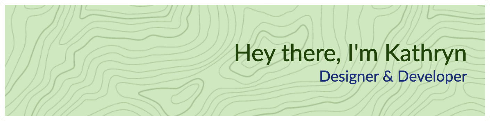
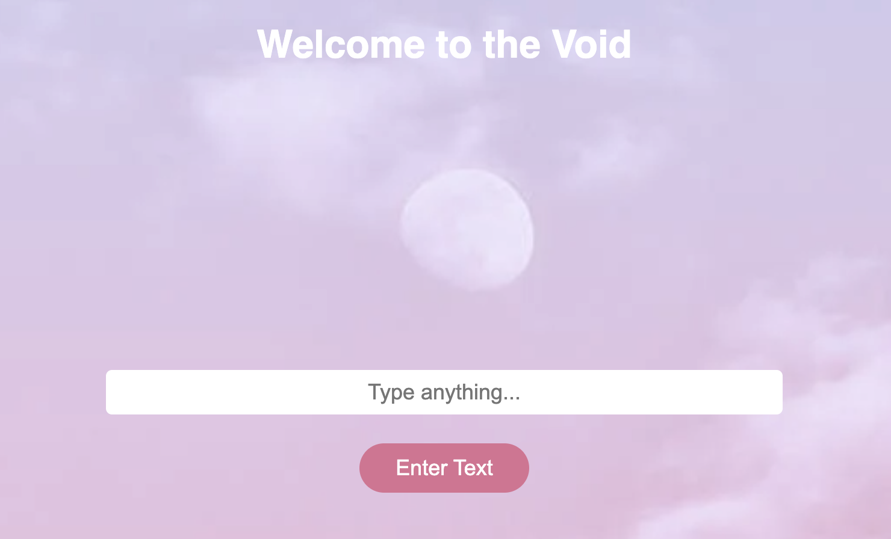
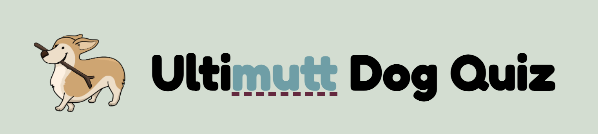

[%7B;makeYourselfSoundCool();%7D)](https://git.io/typing-svg)

## I'm a `designer` and `developer` based in `Canada` 

:woman_technologist: I'm currently learning `node.js` and `react.js`

:hammer_and_wrench: I'm currently designing a `pet health app`

:books: I'm currently reading `Javascript Cookbook`

:dog2: I'm a `foster dog` mom

:headphones: I'm probably listening to `Taylor Swift`, `ABBA`, or `Metric`

 

 You should `follow me` on <a alt="kathryn_codes on twitter" href="https://twitter.com/kathryn_codes">twitter</a>

 

## My Tech Stack :desktop_computer: 

**Software:**

         

**Languages:**

     

 

 

## Some of my projects 	:pencil2:

|    | | 
|---------------------------------------|------------------------------------------|
| **Welcome to the Void** | **Ultimutt Dog Quiz** | 
| A small project I made to practice `CSS Variables`    Uses `HTML`, `CSS`, and `Javascript`    Features multiple different `themes`| A small project I made to practice `async / await` and the `fetch API`    Uses `HTML`, `CSS`, and `Javascript` |
|Repo: https://github.com/kathryncodes/thevoid | Repo: https://github.com/kathryncodes/ultimuttdogquiz |
| Live: https://kathryncodes.github.io/thevoid/ | Live: https://kathryncodes.github.io/ultimuttdogquiz/ |

 

